# Apollo GraphChat: Multi-Source Persisted-Query-Aware AI Chatbot

The Apollo GraphChat project is a chatbot that understands GraphQL schemas and
queries, and in particular knows about a given set of [persisted
queries](https://www.apollographql.com/docs/kotlin/advanced/persisted-queries/),
which are pre-approved operations that can be executed against an Apollo
Router-based gateway.

As a demonstration, this project includes relevant configuration for a
Shopify-esque API, but you can add additional graphs in the [`graphs/`](graphs/)
directory, and the chatbot will be able to answer questions about all of them at
once, potentially combining data from multiple sources.

GraphChat builds on the excellent [MongoDB chatbot
framework](https://github.com/mongodb/chatbot), using [tool
calling](https://mongodb.github.io/chatbot/server/tools/) to execute persisted
queries against the various GraphQL APIs. As a useful remnant of those
beginnings, the chatbot also has knowledge of the chatbot framework running
behind the scenes, and can answer questions about extending or modifying the
behavior of that framework.

Details are documented by Apollo [here](https://docs.google.com/document/u/0/d/1lk1HqdAMWeECZvffoTCcujIhakDwnEGrnX2eGaHeO5g/mobilebasic).

## Prerequisites

- [Node.js](https://nodejs.org/en/download/) (v14 or later)
- [npm](https://www.npmjs.com/get-npm) (comes with Node.js)
- [MongoDB Atlas](https://www.mongodb.com/cloud/atlas) account
- [OpenAI API key](https://platform.openai.com/api-keys)

## Installing the project

```shell
npm install
```

## Setting up a MongoDB Atlas vector store

Instructions for setting up MongoDB Atlas can be found in their
[documentation](https://mongodb.github.io/chatbot/quick-start).

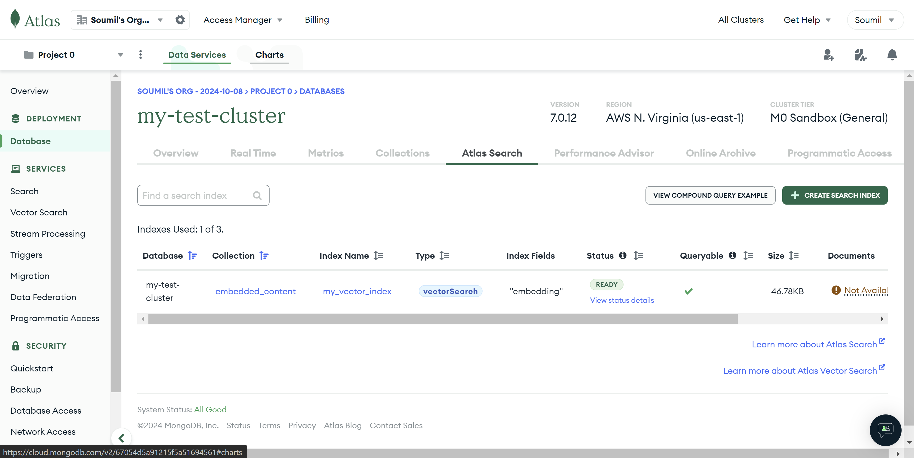

## Setting up GraphOS

To try the chatbot dev kit, we’ll create a new contract variant that we can
associate a hand-crafted persisted query list with. You may already have a
persisted query list you want to use

### Automated Setup - Using Script

1. Create a service API key in GraphOS for the  graph you want to see this with
2. Run setup script with `GRAPHOS_API_KEY`, the script will then:
   - Create a `graphchat` variant on that graph
   - Copy the subgraphs (schema and URL) from a variant in the following order: prod/production/main/current
   - Create a persisted query list associated with the `graphchat` variant

### Manual Setup

1. Navigate to the graph you want to try
2. Create a new variant with your desired name
3. Copy over your subgraphs from whatever is your main or production variant.
   - You can do this in the Subgraphs tab with the “Add Subgraph” button
   - You will need to paste in the URL and schema for each subgraph you add

## OR

## Create a New Supergraph via Apollo Studio

1. Create a new Supergraph
2. Give it a name -> you will need this!
3. Architecture is “Supergraph”
4. It will give you a Rover CLI command
5. COPY the command, and update it to match below
6. Deploy your schema using the following command:

```shell
APOLLO_KEY=$YOUR_APOLLO_KEY rover subgraph publish $YOUR_GRAPH_REF --schema ./graphs/shopify/schema.graphql --name monolith --routing-url https://summit-graphchat.myshopify.com/admin/api/2024-10/graphql.json
```

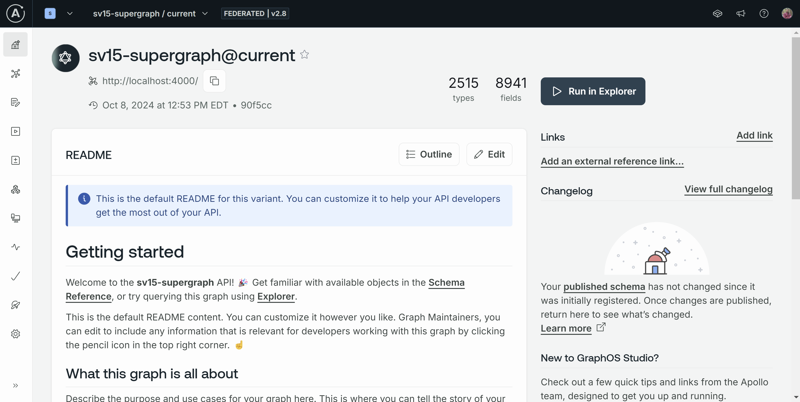

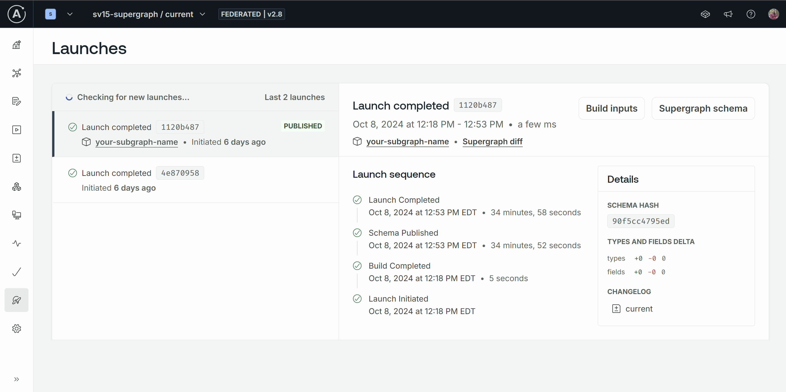

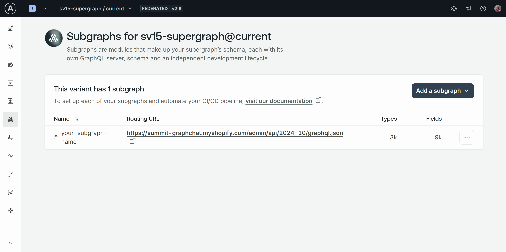

## Setting up `.env` files

Before running this project, you must create appropriate `.env` files in the
root `graphchat/` directory as well as each of the `graphchat/graphs/*`
directories. For guidance, see the corresponding `.env.example` files in those
locations.

## Ingesting data into MongoDB

### Persisted Queries

```shell
# (Re)generate all the graphs/*/operation-manifest.json files
npm run pq:manifest

# Publish all the graphs/*/operation-manifest.json files to GraphOS
npm run pq:publish
```

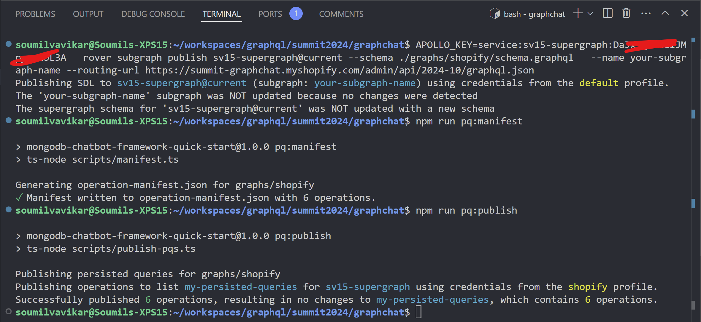

### Vectorize the Schema

- Create a free DB cluster on MongoDB Atlas
- Update for your own MONGODB_CONNECTION_URI and OPENAI_API_KEY in the .env file at the project root.
- Execute the ingest command

```shell
# Ingest all the graphs/*/operation-manifest.json files into MongoDB Atlas
npm run pq:ingest
```

- Create a vector search index on MongoDB Atlas, use the JSON below

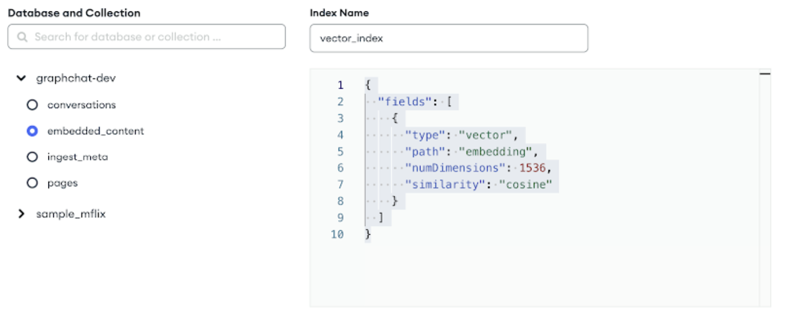

### To Regenrate the Manifest

```shell
# (Re)generate just graphs/shopify/operation-manifest.json
npm run pq:manifest shopify
```

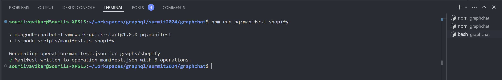

## (Re)publishing persisted queries to GraphOS

```shell
# Publish all the graphs/*/operation-manifest.json files to GraphOS
npm run pq:publish

# Publish just graphs/shopify/operation-manifest.json to GraphOS
npm run pq:publish shopify
```

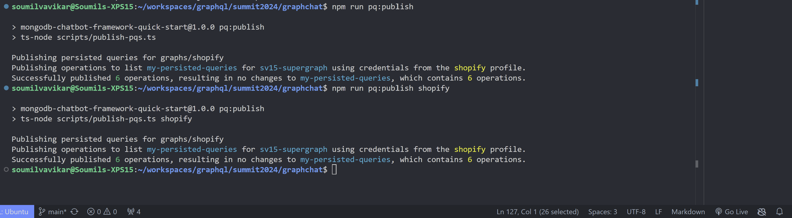

## Running the Supergraph

Once you have performed the above steps, you can run the router(s) with the
following command:

```shell
npm run pq:router
```

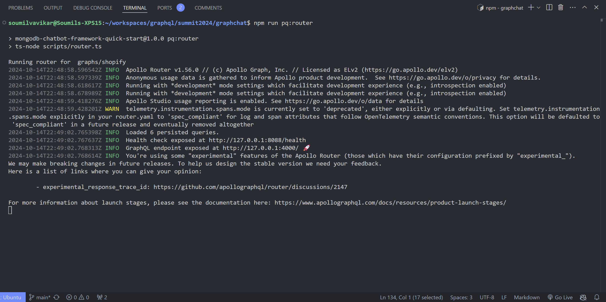

Finally, you can start the GraphChat server and UI with the following command:

```shell
npm run dev
```

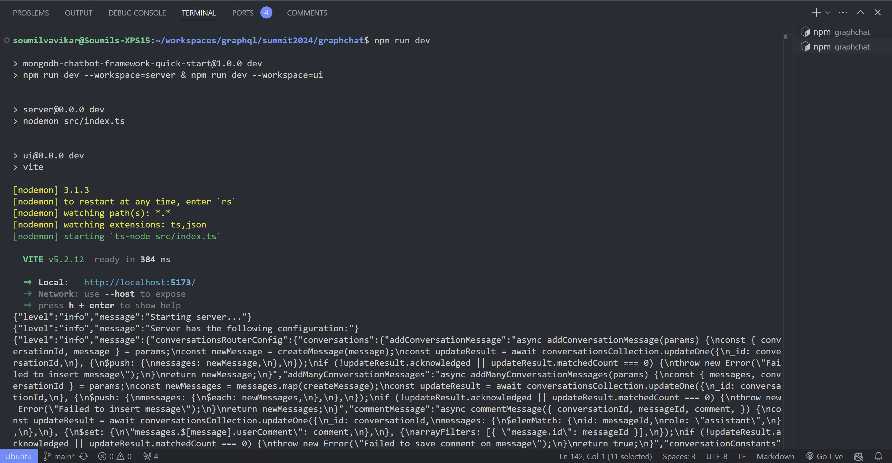

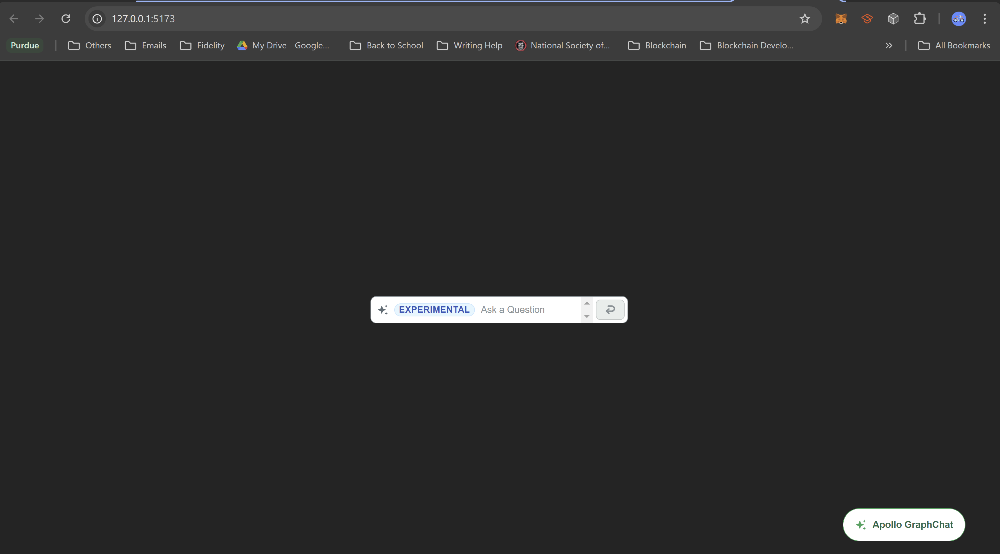

-------------------------------------------------------------------------------

## Licensing

### Overview

GraphChat is an open-source project developed by Apollo Graph, Inc. that includes original code and modifications to the MongoDB Chatbot Framework.

## License Details

The entire project (including all original work by Apollo Graph, Inc. and code derived from the MongoDB Chatbot Framework) is licensed under the Apache License, Version 2.0. This license applies to all files in this repository. You can read the full text of the Apache License, Version 2.0 [here](https://github.com/apollographql/graphchat/blob/main/LICENSE).

Acknowledgment of Original Work. This project includes code derived from the MongoDB Chatbot Framework, originally developed by MongoDB, Inc. The original MongoDB Chatbot Framework is also licensed under the Apache License, Version 2.0, and the starter code relevant to this project can be found [here](https://github.com/mongodb/chatbot/tree/main/examples/quick-start).

## Notice

Please note that this project includes a NOTICE file, as required by the Apache License, Version 2.0. The NOTICE file acknowledges the original work by MongoDB, Inc. and details the contributions by Apollo Graph, Inc.

## Disclaimer

Unless required by applicable law or agreed to in writing, software distributed under this project is provided on an “AS IS” basis, WITHOUT WARRANTIES OR CONDITIONS OF ANY KIND, either express or implied. See the Apache License, Version 2.0 for more details.
